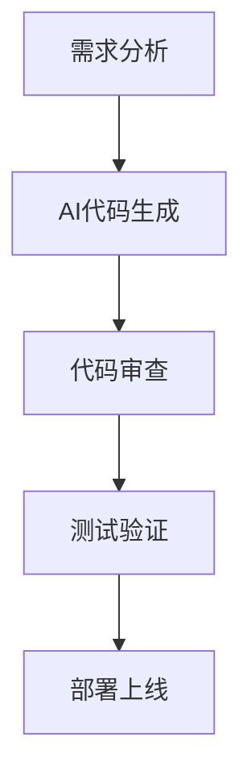

# AI编程助手进阶技巧

## 高级功能应用

### 1. 代码重构
使用AI助手进行代码重构，提升代码质量：

```javascript
// 重构前
function processData(data) {
    var result = [];
    for (var i = 0; i < data.length; i++) {
        if (data[i].active) {
            result.push(data[i]);
        }
    }
    return result;
}

// AI助手建议重构后
function processData(data) {
    return data.filter(item => item.active);
}
```

### 2. 测试生成
自动生成单元测试：

```python
# AI生成的测试代码
import unittest

def add(a, b):
    return a + b

class TestAddFunction(unittest.TestCase):
    def test_add_positive_numbers(self):
        self.assertEqual(add(2, 3), 5)

    def test_add_negative_numbers(self):
        self.assertEqual(add(-1, -1), -2)

    def test_add_zero(self):
        self.assertEqual(add(0, 5), 5)
```

### 3. 文档生成
自动生成代码文档：

```python
def calculate_user_score(activities, weights):
    """
    计算用户综合评分

    Args:
        activities (list): 用户活动列表
        weights (dict): 各项活动权重

    Returns:
        float: 综合评分

    Example:
        >>> activities = ['login', 'post', 'comment']
        >>> weights = {'login': 1, 'post': 3, 'comment': 2}
        >>> calculate_user_score(activities, weights)
        12.0
    """
    score = 0
    for activity in activities:
        score += weights.get(activity, 0)
    return score
```

## 效率提升策略

### 1. 快捷键掌握
- `Ctrl+K` - 快速生成代码
- `Ctrl+I` - 智能补全
- `Ctrl+/` - 代码解释

### 2. 提示词工程
编写有效的提示词：
- **具体**：明确描述需求
- **简洁**：避免冗长描述
- **示例**：提供参考代码

### 3. 工作流优化


## 常见问题解决

### Q1: AI生成的代码有错误怎么办？
- 仔细审查生成的代码
- 分步验证逻辑正确性
- 查阅相关文档

### Q2: 如何避免过度依赖AI？
- 理解每行代码的原理
- 手动实现核心算法
- 定期进行代码review

## 总结

掌握AI编程助手的进阶技巧，让AI成为您真正的编程伙伴。

---

*进阶技巧助您充分发挥AI编程助手的潜力。*
