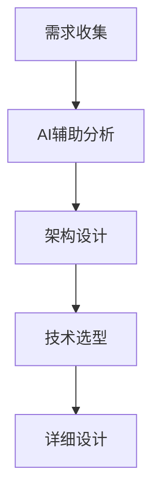

# AI编程助手最佳实践

## 核心原则

### 1. 人机协作
AI编程助手不是替代开发者，而是增强开发者的能力：

```python
# ❌ 过度依赖AI
# 让AI生成整个复杂功能
ai_generate_complex_feature()

# ✅ 合理使用AI
# 使用AI辅助具体实现细节
def calculate_complex_algorithm(data):
    # 开发者设计算法架构
    # AI辅助实现具体计算逻辑
    processed_data = ai_assist_data_processing(data)
    result = ai_assist_optimization(processed_data)
    return validate_result(result)  # 开发者验证结果
```

### 2. 质量保证
建立完整的质量保证体系：

```python
# 代码审查清单
def code_review_checklist(code):
    checks = {
        'functionality': test_functionality(code),
        'performance': analyze_performance(code),
        'security': check_security_vulnerabilities(code),
        'readability': assess_code_readability(code),
        'maintainability': evaluate_maintainability(code)
    }

    return all(checks.values()), checks

# AI辅助代码审查
def ai_assisted_code_review(code_snippet):
    """
    使用AI进行初步代码审查
    """
    review_prompt = f"""
    请审查以下代码，关注：
    1. 潜在的bug
    2. 性能问题
    3. 安全漏洞
    4. 代码风格
    5. 改进建议

    代码：
    {code_snippet}
    """

    ai_feedback = get_ai_feedback(review_prompt)
    return parse_ai_feedback(ai_feedback)
```

## 工作流程优化

### 1. 需求分析与设计


### 2. 开发实施
```python
# 优化的开发流程
class OptimizedDevelopmentWorkflow:
    def __init__(self):
        self.ai_assistant = AIAssistant()

    def implement_feature(self, requirements):
        # 步骤1：AI辅助设计
        design = self.ai_assistant.generate_design(requirements)

        # 步骤2：开发者review设计
        approved_design = self.review_design(design)

        # 步骤3：AI辅助编码
        code_skeleton = self.ai_assistant.generate_code_skeleton(approved_design)

        # 步骤4：开发者完善实现
        final_implementation = self.refine_implementation(code_skeleton)

        # 步骤5：AI辅助测试
        test_cases = self.ai_assistant.generate_test_cases(final_implementation)

        return final_implementation, test_cases
```

### 3. 测试策略
```python
# 分层测试策略
class AIAssistedTesting:
    def __init__(self):
        self.test_levels = ['unit', 'integration', 'e2e']

    def generate_comprehensive_tests(self, code):
        test_suite = {}

        for level in self.test_levels:
            if level == 'unit':
                test_suite[level] = self.generate_unit_tests(code)
            elif level == 'integration':
                test_suite[level] = self.generate_integration_tests(code)
            elif level == 'e2e':
                test_suite[level] = self.generate_e2e_tests(code)

        return test_suite

    def generate_unit_tests(self, code):
        """生成单元测试"""
        prompt = f"""
        为以下代码生成完整的单元测试：
        {code}

        要求：
        1. 覆盖所有分支
        2. 包括边界条件测试
        3. 包含异常处理测试
        """
        return self.ai_assistant.generate_tests(prompt)
```

## 团队协作规范

### 1. 代码审查流程
```python
# 团队协作代码审查
class TeamCodeReview:
    def __init__(self, team_members):
        self.team = team_members
        self.ai_reviewer = AIReviewer()

    def conduct_review(self, pull_request):
        # AI初步审查
        ai_feedback = self.ai_reviewer.review_code(pull_request.diff)

        # 团队成员审查
        human_feedback = []
        for reviewer in self.get_reviewers():
            feedback = reviewer.review_code(pull_request, ai_feedback)
            human_feedback.append(feedback)

        # 综合反馈
        consolidated_feedback = self.consolidate_feedback(
            ai_feedback, human_feedback
        )

        return consolidated_feedback
```

### 2. 知识共享
```python
# 知识库建设
class KnowledgeBase:
    def __init__(self):
        self.ai_patterns = {}
        self.best_practices = []

    def document_ai_pattern(self, pattern_name, description, examples):
        """记录AI使用模式"""
        self.ai_patterns[pattern_name] = {
            'description': description,
            'examples': examples,
            'created_at': datetime.now(),
            'verified': False
        }

    def share_best_practice(self, practice, author):
        """分享最佳实践"""
        self.best_practices.append({
            'content': practice,
            'author': author,
            'votes': 0,
            'created_at': datetime.now()
        })
```

## 风险管理

### 1. 技术风险控制
```python
# 风险控制机制
class AIRiskControl:
    def __init__(self):
        self.risk_levels = ['low', 'medium', 'high', 'critical']

    def assess_risk(self, code_context):
        """评估AI生成代码的风险"""
        risk_factors = {
            'security_sensitive': self.check_security_sensitivity(code_context),
            'business_critical': self.check_business_criticality(code_context),
            'complexity': self.assess_complexity(code_context),
            'dependencies': self.check_external_dependencies(code_context)
        }

        overall_risk = self.calculate_overall_risk(risk_factors)
        return overall_risk, risk_factors

    def apply_safety_measures(self, risk_level, code):
        """根据风险级别应用安全措施"""
        if risk_level == 'critical':
            return self.apply_critical_safety_measures(code)
        elif risk_level == 'high':
            return self.apply_high_safety_measures(code)
        else:
            return self.apply_standard_safety_measures(code)
```

### 2. 备份策略
```python
# 代码备份和版本控制
class CodeBackupStrategy:
    def __init__(self):
        self.backup_frequency = 'daily'

    def create_backup(self, code_base):
        """创建代码备份"""
        timestamp = datetime.now().strftime('%Y%m%d_%H%M%S')
        backup_name = f"backup_{timestamp}"

        # 创建完整备份
        self.backup_code_files(code_base, backup_name)

        # 记录备份信息
        self.log_backup(backup_name, code_base)

        return backup_name

    def restore_from_backup(self, backup_name):
        """从备份恢复"""
        if self.verify_backup(backup_name):
            return self.restore_code_files(backup_name)
        else:
            raise Exception("Backup verification failed")
```

## 持续改进

### 1. 效果评估
```python
# 效果评估指标
class AIEffectivenessMetrics:
    def __init__(self):
        self.metrics = {
            'productivity': [],
            'quality': [],
            'satisfaction': []
        }

    def track_productivity(self, before_ai, after_ai):
        """跟踪生产力变化"""
        improvement = (after_ai - before_ai) / before_ai * 100
        self.metrics['productivity'].append(improvement)
        return improvement

    def assess_quality(self, code_quality_scores):
        """评估代码质量"""
        avg_quality = sum(code_quality_scores) / len(code_quality_scores)
        self.metrics['quality'].append(avg_quality)
        return avg_quality
```

### 2. 反馈循环
```python
# 持续改进循环
class ContinuousImprovement:
    def __init__(self):
        self.feedback_loop = []

    def collect_feedback(self, user_feedback, metrics):
        """收集反馈"""
        self.feedback_loop.append({
            'feedback': user_feedback,
            'metrics': metrics,
            'timestamp': datetime.now()
        })

    def analyze_and_improve(self):
        """分析反馈并制定改进措施"""
        insights = self.analyze_feedback_patterns()
        improvements = self.generate_improvement_actions(insights)
        return improvements
```

## 总结

遵循这些最佳实践，可以最大化AI编程助手的价值，同时控制相关风险。

---

*最佳实践指导您安全高效地使用AI编程助手。*
